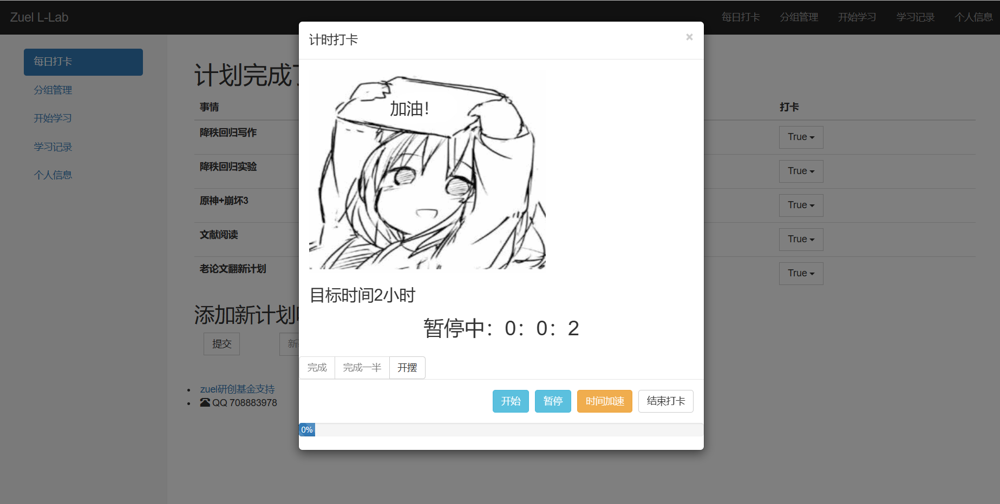
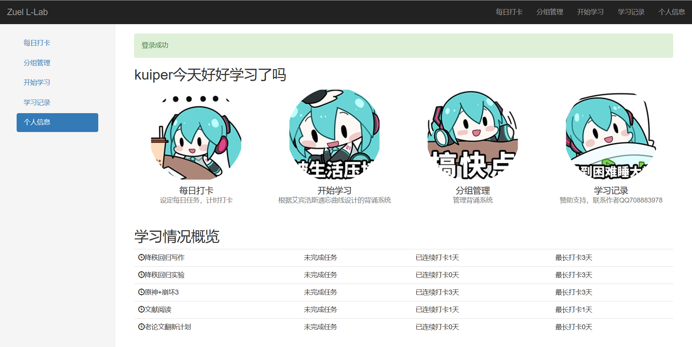
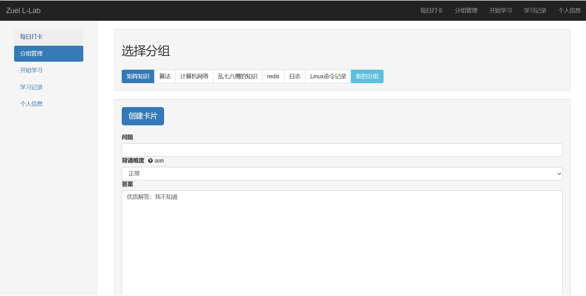
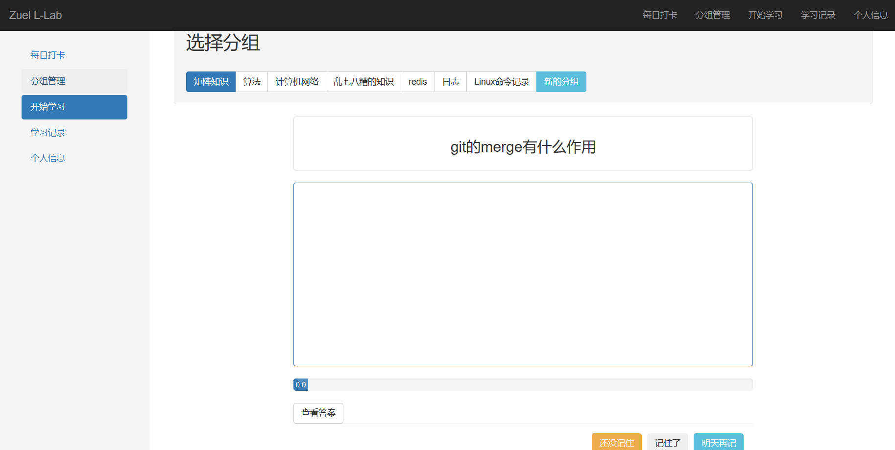
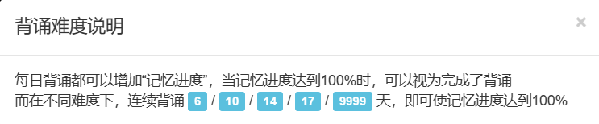
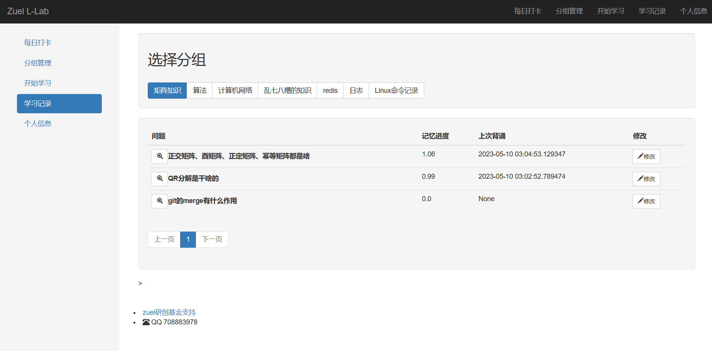

# zuel-learning-lab

## 简介

这是一个简单的flask项目，用来将一些已经成熟的想法，从python的大黑框搬到web界面上，便于后续的使用。

作者非计算机科班出身，随便做着试试吧，使用flask+sqlite的框架，由于便宜服务器性能有限，暂不考虑深度学习系列的功能

## 使用方法

需要下载requirement的模块与sqlite，然后运行app.py，如果不想在自己电脑上安装乱七八糟的模块，也可以使用已上线服务器端的http://101.42.53.180:5000
，这是一个尚未备案的网站

### 打卡功能

提供了普通的打卡与计时打卡的功能，计时打卡不能退出

打卡记录可以在人个信息中查看

提供了一个简单的日历来查看历史打卡记录

### 背诵功能

辅助背诵功能借鉴自“墨墨背单词”的思路，使用艾宾浩斯遗忘曲线，来进行有计划的每日背诵，增加“背诵进度”。但与墨墨背单词大不相同的地方是，由于偶尔的偷懒行为可能会导致整个背诵计划归零，重启计划时会一下面临一大堆堆积任务，这实在是太残忍了，因此这里的算法设计，你的背诵进度，只会增加或不变，不会减少！！！

具体来说，在“分组管理”中添加需要背诵的问题和内容：

然后在开始学习中背诵，这里会按照你的背诵进度，从低到高显示所有问题，由于前面设置的进度只会增加不会减少，所以即使是进度100的内容，还是会出现在最后，努力复习吧：

这里特别设置了一组背诵难度，因此，具体描述如下

提供一个管理界面，用于变更难度和改问题：

